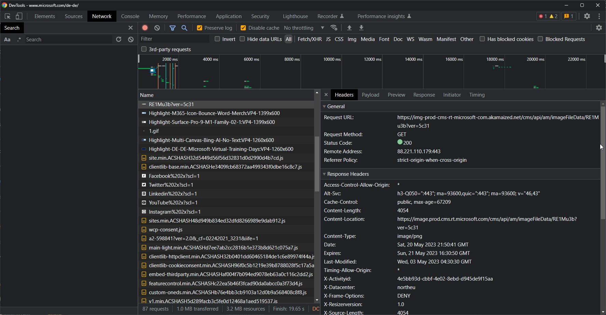
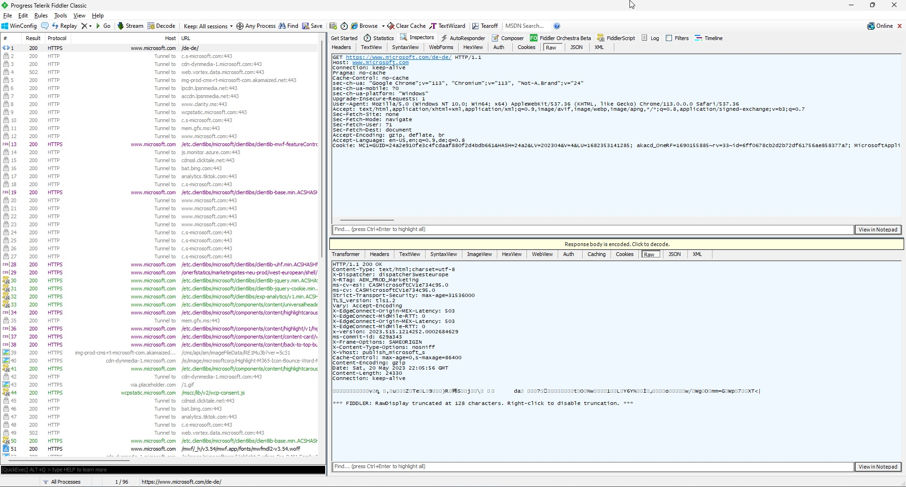
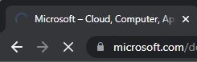

# HTTP
HTTP stands for <u>H</u>yper<u>t</u>ext <u>T</u>ransfer <u>P</u>rotocol. It describes a format which can be used by a client (e.g. a browser, like Chrome) can communicate with a Server. It is basically a text-message sent from one end to the other in a specific format and back.

Such a row (request) is done for EVERY ressource that has to be loaded from the other side (e.g. one request for every JS-file, every CSS-file and every image).

## Inspection
If you want to have a simple look at it, open your browser now. Hit **F12**. An inspector opens itself. You'll find at the upper end of the inspector a tab called "Network".
There should be a long list of rows containing a lot of files the browser asks for. If you do not see any, look for the red "recording" button. And if that one is on, just reload the website you're on.



Here I have selected a row in the list, so you can see details of the request on the right side. In the screenshot it starts with the line "Request URL". Above those details you can dig deeper into the response with the tabs "Payload" and "Response".

I personally prefer for a few years already now the tool "[Fiddler](https://www.telerik.com/fiddler/fiddler-classic)". The classic version here is fully sufficient and currently free.

When you open it the first time it asks you if it might install some certificates to be able to inspect https (secure) traffic.

To achieve the same inspection as in the browsers network inspector, one row from the left side. Then choose the "Inspectors"->"RAW" tab for both windows on the right side.



## Structure
Let's take a look at this example request.

REQUEST:
``` http
GET https://www.microsoft.com/de-de/ HTTP/1.1
Host: www.microsoft.com
Connection: keep-alive
Upgrade-Insecure-Requests: 1
User-Agent: Mozilla/5.0 (Windows NT 10.0; Win64; x64) AppleWebKit/537.36 (KHTML, like Gecko) Chrome/113.0.0.0 Safari/537.36
Accept: text/html,application/xhtml+xml,application/xml;q=0.9,image/avif,image/webp,image/apng,*/*;q=0.8,application/signed-exchange;v=b3;q=0.7
Sec-Fetch-Site: none
Sec-Fetch-Mode: navigate
Sec-Fetch-User: ?1
Sec-Fetch-Dest: document
sec-ch-ua: "Google Chrome";v="113", "Chromium";v="113", "Not-A.Brand";v="24"
sec-ch-ua-mobile: ?0
sec-ch-ua-platform: "Windows"
Accept-Encoding: gzip, deflate, br
Accept-Language: en-US,en;q=0.9,de;q=0.8
Cookie: Key=Value
```

Let's have a look at the most important lines here...

- **GET https://www.microsoft.com/de-de/ HTTP/1.1**
    - This line specifies the so called "VERB" GET. In this case this basically means "return to me the ressource that is comming now". Followed by the https-address of the ressource. So there is no specific file after "de-de", which means there will some default-file in that directory be selected. And at the end there is the protocoll version "HTTP/1.1".

- **Host: www.microsoft.com**
- **User-Agent: Mozilla/5.0 (Windows NT 10.0; Win64; x64) AppleWebKit/537.36 (KHTML, like Gecko) Chrome/113.0.0.0 Safari/537.36**
    - Host and User-Agent are just two of the so called "Headers". Which have a key, followed by a colon and then a value. The Host header for example can be used to specify the site of the ressource further ... or the "User-Agent" informs the server about what the user is using to visit that ressource. So for example you could decide to serve a different site, if someone visits the page with the Internet Explorer. 

- **Cookie: Key=Value**
    - And one more line that might be really interesting to you is a specific header. The COOKIE header. You hear everywhere about those "bad cookies". The cookie header is basically the way how a website can identify a visitor that comes back multiple times, as the browser is always sending something like User=Tom with every request to the server.

- **Body**
    - Something that you can not see above is the http-BODY. The reason why you currently can't see it, is that it is not being submitted when the VERB of the request is "GET". If the VERB would be POST for example, there'd be everything that you want to send to the server as a message below the Cookie-Header. __Important__ to remember ... There is a GET verb that is what the browser normally does ... and a POST verb when you submit a form.

RESPONSE:
``` http
HTTP/1.1 200 OK
Content-Type: text/html;charset=utf-8
X-Dispatcher: dispatcher3westeurope
X-RTag: AEM_PROD_Marketing
ms-cv-esi: CASMicrosoftCV1e83190a.0
ms-cv: CASMicrosoftCV1e83190a.0
Strict-Transport-Security: max-age=31536000
TLS_version: tls1.2
Vary: Accept-Encoding
X-EdgeConnect-Origin-MEX-Latency: 503
X-EdgeConnect-MidMile-RTT: 0
X-EdgeConnect-Origin-MEX-Latency: 503
X-EdgeConnect-MidMile-RTT: 0
x-version: 2023.515.1214252.0002684629
ms-commit-id: 629a343
X-Frame-Options: SAMEORIGIN
X-Content-Type-Options: nosniff
X-Vhost: publish_microsoft_s
Cache-Control: max-age=0,s-maxage=86400
Date: Sat, 20 May 2023 22:28:59 GMT
Content-Length: 152025
Connection: keep-alive

<!DOCTYPE HTML>
<html lang="de-DE" dir="ltr">
    ...
</html>
```

... and again the most important lines - now of the response ...


- **HTTP/1.1 200 OK**
    - Again the protokoll version, followed by a numeric value and a written version of the numeric code. Basically you can ignore everything here besides the number. 200 in our case is "OK" ... so the request worked fine. Very well known statuses are:
        - 200 OK (2xx are success messages)
        - 301 Moved (3xx are redirects)
        - 404 Not found (4xx are client-errors)
        - 500 Internal server error (5xx are server errors)

- **Content-Type: text/html;charset=utf-8**
    - This header describes the type of content that is being sent from the server to the client. In this case it's a "normal" html file and the text-encoding of that file is utf-8.

- **&lt;!DOCTYPE HTML&gt;**
    - It's not this specific line, but starting with the doctype-line here - two lines below the headers - is the beginning of the BODY. That is were the actual document from the server is sent to the client.

# Ajax
When you browse between pages in the internet, you can see at the icon of your browser tab a loading symbol during navigation:



As you want to simulate the behavior of an application and just want to changes parts of your site instead of fully reloading it, there is a technique, that was originally known as "ajax". Ajax stood for "asynchronous javascript and xml", which basically meant that you downloaded xml in an asynchronous way (so while the rest of the page keeps doing what it's currently doing) via javascript.

The way the browser is able to load data from the server without visibly reloading the website is called "XmlHttpRequest".

## XmlHttpRequest

There is a nice [Wikipedia Article](https://en.wikipedia.org/wiki/XMLHttpRequest) about XmlHttpRequest. It is basically a specific kind of object that you initialize in javascript and use it to communicate with the server. The example code looks like this:

```Javascript
var request = new XMLHttpRequest();

request.onreadystatechange = function()
{
    if ( request.readyState == 4 )
    {
        alert(request.responseText);
    }
}

request.open( "GET", submit_url );
request.send( null );
```

What this does is:
- It creates an object of type XmlHttpRequest.
- It defines a callback in the property "onreadystatechange" of the request object. This method is called as soon as there is any result from the loading. This is called e.g. when the connection has been established. To only react on loaded data from the server, we check against readystate "4", which is "request completed".
- Then we basically do what the browser does - we ask the request object to open a request with the verb GET and a specific target url.
- And then at last we start the request via "send".

You'll get the response you asked for then in the "request.responseText" property. (There is for example your JSON that you returned from the server as text inside and you'd just have to parse it).

## Fetch

As the XmlHttpRequest neither has an intuitive name nor can someone easly guess that "onreadystate"-stuff - and foremose chained calls ended easily up in the "callback hell", a cleaner implementation was developed. The fetch-method uses the so called promises (you can identify them when there's a "then" at the end of your call)

EXAMPLE FETCH:
```Javascript
fetch(submit_url, {
    method: 'GET',
    headers: {
        'Accept': 'application/json',
    },
})
.then(response => response.json())
.then(response => console.log(JSON.stringify(response)))
```

... but you could also write that with the async/await pattern:
```Javascript
async function loadData() {
  const response = await fetch(submit_url);
  const jsonData = await response.json();
  console.log(jsonData);
}
```

That looks way simpler doesnt it? Now imagine you return something from the server like:
```JSON
{
    "products": [...]
}
```

You could then immediately keep working with the products-array in your last "then"/the "jsonData" in your javascript after the call. 

# CORS

When you're locally developing, you often find yourself confronted during the early days with the following message:

- "Refused to connect to 'xyz' because it violates the following Content Security Policy directive: ..."
- "Refused to connect to 'xyz' because it violates the document's Content Security Policy."

This might sound at first like the server rejected your request, but actually it is your browser that protects you. This is called CORS (Cross-Origin-Resource-Sharing). If your website makes a request to another page (so if the domain, the protocol or the port differ), the browser will ask the target server if that is ok.

Why would you protect your current site by asking someone else? This is not meant to protect the site you're browsing from itself. It there's a security issue with the page you're on ... it's thats sites problem ... 
But if you're on one site - THAT page you're currently browsing should NOT affect the security of other sites. Imagine the following:
- You're logged in at facebook.com
- You're browsing somesite.xyz
- Now somesite.xyz has a javascript that asks facebooks API to load all private messages (as you're already logged into facebook, so a request to facebook.com will include your session cookie).

That wouldn't be great, would it?

So CORS will make sure that the browser asks facebook.com if it's ok for somesite.xyz to send that request towards facebook.com.

If the behavior is intended by facebook however, that somesite.xyz can load data (e.g. because it's a company of the same group) - facebook.com could set specific headers:

- Access-Control-Allow-Origin: Here somesite.xyz would have to be specified as allowed request-origin. You could also specify a asterisk (*) as a wildcard to allow requests from all sites.
- Access-Control-Allow-Methods: Here you can specify the VERBs that are allowed in the requests ... e.g. if only POST, but no DELETE requests are allowed.

There are at least three more headers for that topic ("Access-Control-Allow-Headers", "Access-Control-Expose-Headers", "Access-Control-Allow-Credentials"), but specifying the above ones is sufficient.

Example of nodejs http-server response with headers:
```Javascript
const server = http.createServer((req, res) => {
    const headers = {
        'Access-Control-Allow-Origin': '*',
        'Access-Control-Allow-Methods': 'OPTIONS, POST, GET'
    };

    if (req.method === 'OPTIONS') {
        res.writeHead(204, headers);
        res.end();
        return;
    }
    
    res.writeHead(200, headers);
    res.end("result");
});
```

But why do we handle OPTIONS request here differently? An OPTIONS request is a so called "preflight" request. The browser itself decides when to send this request. It is (as the name sais) a request before the real request. So for example if you want to send a PUT request to the server (which is normally used to update a ressource), the browser will issue an OPTIONS request first to check if the verb PUT is allowed. If your server does not respond to the OPTIONS request in a appropriate manner, the actual request (PUT in that case) wont be send by the browser.

So what we do here is basically replying with "nothing to add here" to the options request - still sending the same allow-headers, so the preflight knows if the next request is valid or not. 


Info:
At least at chrome there is a parameter to start chrome with, that can disable the CORS check ... in case you know what you're doing and e.g. want to test something ... Seach for "chrome disable-web-security".